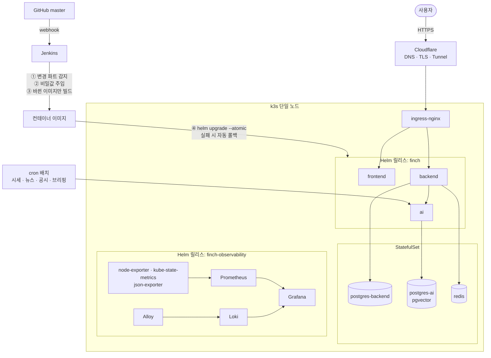

# FINCH Infra

**단일 서버 위의 k3s 운영 환경** — [FINCH](https://github.com/Team-FINCH/finch-docs) 의 인프라입니다.


> 담당: 장준환 [@prgmd](https://github.com/prgmd)

## 구성



## 이렇게 운영했습니다

- **Docker Compose → k3s 이전** — 앱(`finch`)과 관측 스택(`finch-observability`)을 별도 Helm 릴리스로 분리. Compose 구성은 롤백 경로로 유지
- **변경된 파트만 배포** — Jenkins 가 커밋 범위를 보고 바뀐 서비스 이미지만 빌드하고, `--atomic` 으로 실패 시 자동 롤백
- **Cloudflare Tunnel 노출** — 도메인·TLS 를 Cloudflare 에서 처리하고 터널로 클러스터에 연결
- **복구 리허설** — 운영을 건드리지 않고 DB 덤프·Jenkins 백업을 임시 환경에 복원해 실측 (DB 1초 미만, Jenkins 16초)
- **관측** — 서비스 로그를 `X-Request-Id` 로 연결, Grafana 로 서비스 지표와 AI 토큰 비용 대시보드 운영
- **배치 스케줄** — 시세·뉴스·공시 수집과 데일리 브리핑 생성을 cron 으로 운영

## 구조

```
k8s/charts/finch/                  앱 Helm 차트
k8s/charts/finch-observability/    관측 스택 Helm 차트
docker/                            서비스 Dockerfile
scripts/                           배치 · 백업 · 운영 스크립트
Jenkinsfile                        CI/CD 파이프라인
```

서버 구축·배포·백업·장애 대응 절차는 [OPERATIONS.md](OPERATIONS.md) 에 있습니다.
