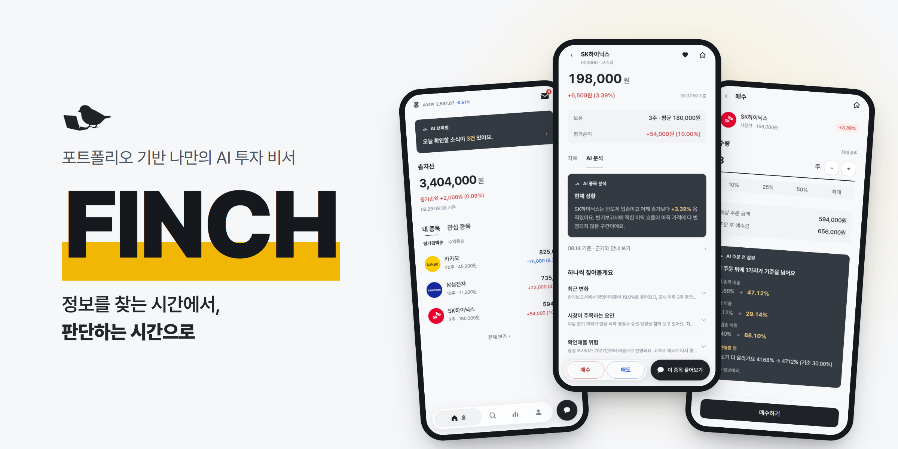
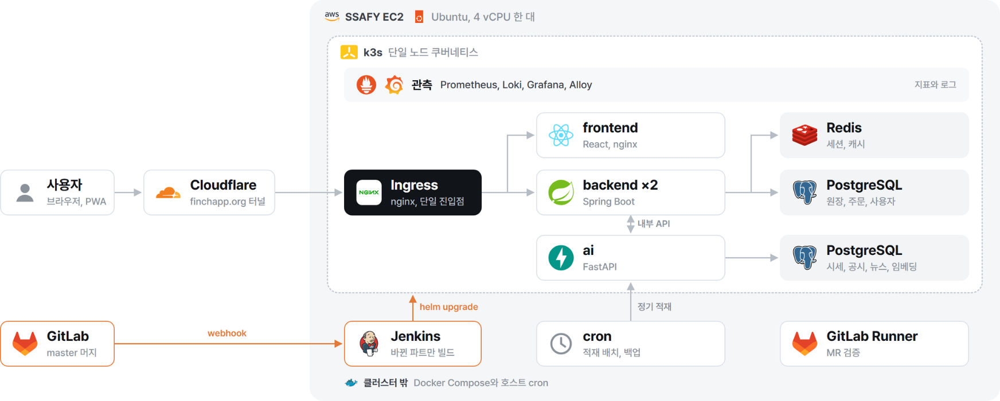

<div align="center">



# FINCH Infra

**단일 서버 위의 k3s 운영 환경**

[](https://finchapp.org)
[](https://github.com/Team-FINCH/finch-docs)
[](OPERATIONS.md)

</div>

## ⚙️ 운영 방식

| 흐름 | 무엇 | 설명 |
| ---- | ---- | ---- |
| 진입 | **단일 진입점** | Cloudflare 가 DNS 와 TLS 를 처리하고 터널로 클러스터에 연결. 외부로 열린 것은 ingress-nginx 하나 |
| 배포 | **변경된 파트만 빌드** | Jenkins 가 커밋 범위를 보고 바뀐 서비스 이미지만 빌드 |
| 배포 | **실패하면 되돌린다** | `helm upgrade --atomic` 으로 배포 실패 시 자동 롤백 |
| 격리 | **AI 서비스 비노출** | ai 는 Ingress 에 경로가 없고 backend 만 내부에서 호출 |
| 저장 | **DB 를 둘로 분리** | 원장 트랜잭션과 벡터 검색이 같은 인스턴스를 다투지 않게 분리 |
| 관측 | **앱 코드를 건드리지 않는 수집** | Alloy 가 컨테이너 로그를 긁어 Loki 로 보냄. 적재 코드 0줄 |
| 관측 | **요청 하나를 끝까지 추적** | `X-Request-Id` 로 서비스 로그를 연결 |
| 관측 | **지표와 비용을 한 화면에** | Grafana 로 서비스 지표와 AI 토큰 비용 대시보드 운영 |
| 복구 | **복원해 본 백업만 백업이다** | 운영을 건드리지 않고 DB 덤프와 Jenkins 백업을 임시 환경에 복원해 실측 (DB 1초 미만, Jenkins 16초) |
| 배치 | **수집과 브리핑 스케줄** | 시세, 뉴스, 공시 수집과 데일리 브리핑 생성을 cron 으로 운영 |

## 🛠️ Tech Stack


| 분류 | 사용 기술 |
| ---- | --------- |
| 오케스트레이션 | k3s (단일 노드) |
| 패키징과 배포 | Helm, Jenkins |
| 컨테이너 | Docker, Dockerfile 4종 |
| 진입과 네트워크 | ingress-nginx, Cloudflare Tunnel |
| 지표 | Prometheus, node-exporter, kube-state-metrics, json-exporter |
| 로그 | Alloy, Loki |
| 시각화 | Grafana |
| 데이터 | PostgreSQL 17, pgvector, Redis |
| 서버 | AWS EC2 |
| 자동화 | Shell, Python (환경변수 계약 검사) |

## 🧭 아키텍처



**앱과 관측 스택을 별도 Helm 릴리스로 분리했습니다.** 관측을 다시 배포해도 앱이 내려가지 않고, 그 반대도 같습니다.
Docker Compose 구성은 지우지 않고 롤백 경로로 남겨 뒀습니다.

## 📂 구조

```
k8s/
├── charts/finch/                  앱 Helm 차트
├── charts/finch-observability/    관측 스택 Helm 차트
├── manifests/                     클러스터 공통 매니페스트
└── scripts/                       클러스터 운영 스크립트
docker/                            서비스 Dockerfile
observability/                     Alloy, Loki, Prometheus, Grafana 설정
nginx/                             Compose 시절 리버스 프록시 설정
scripts/                           배치, 백업, 복원, 점검 스크립트
Jenkinsfile                        CI/CD 파이프라인
setup-server.sh                    서버 첫 구축
docker-compose*.yml                이전 구성. 롤백 경로로 유지
```

**주요 스크립트**

| 파일 | 하는 일 |
| ---- | ------- |
| `backup-db.sh` / `restore-db.sh` | DB 덤프와 복원 |
| `backup-jenkins.sh` | Jenkins 홈 백업 |
| `check-env-contract.py` | `application.yaml` 이 요구하는 환경변수와 실제 Secret 주입을 대조 |
| `verify-ai-keys.sh` | AI 키가 실제로 읽히는 위치에 있는지 확인 |
| `cutover-diff.sh` | 이전 전후 구성 대조 |
| `ingest-batch.sh` | 시세, 뉴스, 공시 수집 배치 |
| `renew-cert.sh` | 인증서 갱신 |

서버 구축, 배포, 백업, 장애 대응 절차는 [OPERATIONS.md](OPERATIONS.md) 에 있습니다.

## 🧑🏻‍💻 Developers

|  |
| :----------------------------------------------------: |
|                       **장준환**                        |
|          [@prgmd](https://github.com/prgmd)            |
